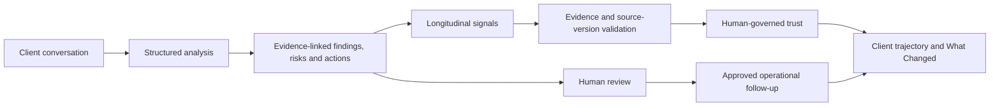
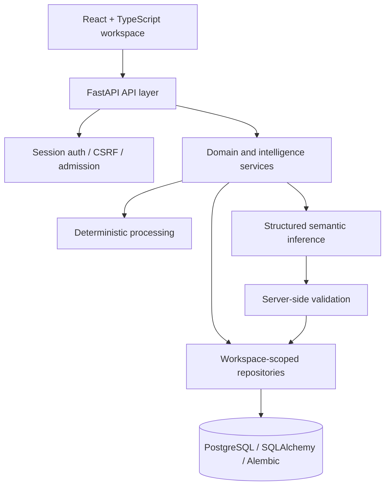

# Client Intelligence OS

**Evidence-grounded client intelligence for human-controlled, high-context client workflows.**

> **Status:** Active development · Longitudinal intelligence merged on `main` · Public production deployment intentionally deferred while cross-stack hardening continues

Client Intelligence OS is a full-stack Applied AI system that turns repeated client conversations into **structured, source-linked intelligence, accountable follow-up, and longitudinal change**.

The core engineering principle is:

> **AI can propose and interpret. Application state, evidence, permissions, versions, and consequential approvals remain authoritative outside the model.**

That makes ClientOS less like a transcript summarizer and more like an operating layer for relationship intelligence.

---

## The problem

High-context client work creates a continuity problem.

Across repeated conversations, important information becomes fragmented across notes and memory:

- recurring challenges;
- changing priorities;
- risks and unresolved concerns;
- decisions and commitments;
- follow-up ownership;
- completed versus missed actions;
- evidence supporting each conclusion.

A conventional LLM summary can describe one conversation.

ClientOS is being built to answer the harder operational question:

**What changed across the relationship, what evidence supports it, and what should a human review or act on next?**

---

## Product loop



In text:

**Conversation → Evidence → Structured Intelligence → Human Review → Operational Action → Follow-up → Longitudinal Change**

---

## What is implemented on `main`

| Area | Current capability |
| --- | --- |
| **Conversation intelligence** | Structured findings, risk flags, recommended actions, missing information, and exact source references |
| **Human review** | Explicit analysis-review states before downstream operational use |
| **Follow-up workflow** | Action Items with assignees, due dates, completion outcomes, queues, and stale-write protection |
| **Longitudinal intelligence** | Persisted signals, evidence and revisions; draft/trusted/rejected/revalidation states; refresh, trajectory, What Changed, and review surfaces |
| **Multi-tenant backend** | Authenticated workspace boundaries, workspace-scoped persistence, CSRF-protected mutations, non-disclosing object access patterns |
| **AI boundary** | Structured provider output, deterministic processing paths, provider isolation, bounded inference/admission controls |
| **Frontend** | React + TypeScript review/workspace experience with typed API integration and conflict handling |
| **Production boundary** | Database preflight, request/security controls, deployment assumptions and explicit scale constraints |

The longitudinal slice is merged into the default branch and is still being hardened before public deployment.

---

## Why this is more than an LLM wrapper

### 1. Evidence is a first-class object

Model output is not accepted as an unsupported conclusion.

Analysis artifacts carry source references, and longitudinal intelligence is built around persisted evidence relationships rather than an opaque rolling summary.

For longitudinal signals, the system stores concepts such as:

- canonical signal identity;
- signal kind;
- temporal state;
- trend direction;
- trust state;
- first/last observation;
- source evidence;
- source versions;
- revision history.

### 2. Deterministic facts and semantic inference are separated

The application does not ask an LLM to calculate everything.

Deterministic application logic owns factual behavior such as:

- Action Item lifecycle facts;
- completion/open state;
- chronology;
- counts;
- persisted versions;
- authorization;
- source eligibility.

Semantic inference is reserved for bounded interpretation where meaning—not database truth—is required.

### 3. AI does not grant itself authority

Provider output cannot decide that its own proposal is trusted.

Longitudinal intelligence uses explicit human-governed states:

```text
draft
trusted
rejected
needs_revalidation
```

The data model also supports moving previously trusted intelligence back to **needs revalidation** when material evidence changes, rather than silently allowing an AI-generated profile to drift away from its sources.

### 4. Operational work stays human-controlled

Approved recommendations can enter the Action Item workflow, but the AI does not autonomously:

- assign people;
- schedule due dates;
- mark work complete;
- invent completion outcomes;
- retry stale human mutations;
- execute external actions.

### 5. Multi-tenant and concurrency concerns are part of the product

ClientOS treats backend correctness as product behavior.

The codebase includes patterns for:

- workspace-scoped repository access;
- client/source scoping;
- BOLA-resistant object lookup;
- CSRF protection;
- non-disclosing foreign-resource behavior;
- optimistic concurrency;
- explicit stale-write conflicts;
- isolated admission/rate-policy capacity;
- sanitized provider/database failure surfaces.

---

## Longitudinal intelligence

The longitudinal layer is designed to make repeated conversations useful as a **relationship history**, not just a pile of summaries.

It can represent controlled temporal states such as:

- emerging;
- active;
- recurring;
- resolving;
- resolved;
- reopened;
- superseded.

Trend direction is modeled separately from temporal state so the system can distinguish, for example, a recurring theme from whether that theme is improving or worsening.

The resulting product surface is intended to answer questions such as:

- **What is new?**
- **What is recurring?**
- **What appears to be improving?**
- **What is worsening?**
- **What has resolved?**
- **What has reopened or been superseded?**
- **Which commitments remain open?**
- **Which commitments were completed?**

These projections remain evidence-linked and separate review-required intelligence from trusted trajectory.

---

## Human-controlled follow-up

Approved recommendations can be materialized into Action Items while preserving client/source context.

The workflow supports:

- workspace-scoped assignees;
- due-date updates and clearing;
- open / due-today / overdue / upcoming / completed / no-due queues;
- human-authored completion outcomes;
- historical disabled-assignee retention rules;
- optimistic version checks;
- stale-write conflict responses;
- explicit lifecycle changes instead of hidden automation.

---

## Architecture



The model/provider layer is deliberately outside the authority boundary for authentication, tenant ownership, database identifiers, trust state, versions, lifecycle state, and operational counts.

---

## Reliability and verification

The repository uses behavioral and adversarial tests rather than treating a successful model response as sufficient proof.

Coverage includes areas such as:

- migration and persistence invariants;
- workspace/tenant isolation;
- CSRF and authenticated mutation paths;
- BOLA/non-disclosure behavior;
- analysis review state;
- Action Item lifecycle and queues;
- optimistic concurrency and stale writes;
- rate/admission isolation;
- longitudinal signal/evidence persistence;
- source-version handling;
- refresh/idempotence behavior;
- malformed provider output;
- frontend API validation and conflict behavior.

The project is still under active integration, so the repository does **not** claim production certification merely because focused tests pass.

---

## Tech stack

**Backend**

Python · FastAPI · Pydantic · SQLAlchemy · Alembic · PostgreSQL · pytest

**AI / inference**

Groq-hosted model path · structured outputs · bounded semantic inference · deterministic processing/fallback paths · server-side provider validation

**Frontend**

React · TypeScript · Vite · typed API client · component/route testing

**Engineering themes**

REST APIs · multi-tenant authorization · human-in-the-loop AI · evidence provenance · optimistic concurrency · database migrations · security regression testing · deterministic fallbacks

---

## Repository map

```text
backend/
  app/
    api/              FastAPI routes and admission boundaries
    models/           SQLAlchemy persistence records
    repositories/     workspace-scoped data access
    schemas/          API and provider contracts
    security/         sessions, CSRF and admission controls
    services/         analysis and longitudinal intelligence
  migrations/         Alembic migrations

frontend/
  src/
    components/
    routes/
    services/
    types/

tests/
  backend/             persistence, API, security and AI-system tests

docs/
  superpowers/
    specs/             reviewed design specifications
    plans/             implementation plans
```

---

## Engineering documentation

The architectural reasoning is intentionally kept in the repository rather than only in chat/history.

- [Longitudinal Client Intelligence design](docs/superpowers/specs/2026-09-07-longitudinal-client-intelligence-design.md)
- [Longitudinal implementation plan](docs/superpowers/plans/2026-09-08-longitudinal-client-intelligence.md)
- [Production & security operating notes](docs/production-security.md)

These documents capture invariants, trust boundaries, failure behavior, human-control requirements, and implementation sequencing.

---

## Run locally

### Backend

From the repository root:

```powershell
.\.venv\Scripts\python.exe -m pip install -r backend\requirements.txt
.\.venv\Scripts\python.exe -m uvicorn backend.app.main:app --reload
```

Backend development server:

```text
http://127.0.0.1:8000
```

### Frontend

```powershell
cd frontend
npm install
npm run dev
```

The Vite development server uses:

```text
http://localhost:3000
```

and proxies `/api` traffic to the local FastAPI backend.

The complete authenticated workflow requires local OIDC/Auth0 configuration. Credentials and `.env` contents are intentionally excluded from the repository.

### Tests / quality checks

```powershell
.\.venv\Scripts\python.exe -m pytest tests\backend -q
cd frontend
npm test
npm exec -- tsc -p tsconfig.app.json --noEmit
npm run build
```

---

## Current status

Client Intelligence OS is **not currently advertised as a live production SaaS**.

That is intentional.

The current focus is to finish cross-stack hardening and release-readiness before presenting the product as publicly deployed. The architecture and code are being developed toward a Premium V1 that can support deeper client briefs, evaluation/quality measurement, outcome intelligence, controlled agentic workflows, broader team/client surfaces, and production observability without weakening evidence provenance or human control.

---

## Design philosophy

ClientOS is an experiment in building AI products where **system engineering matters at least as much as the model call**.

The project favors:

- provenance over opaque answers;
- structured contracts over unconstrained model text;
- server authority over model authority;
- deterministic facts over unnecessary inference;
- explicit human approval over silent automation;
- tenant isolation and concurrency correctness;
- fail-safe degradation over fabricated certainty;
- inspectable engineering decisions over demo-only behavior.

---

## Maintainer

**Saurav Kumar Jha**

Applied AI · Backend Engineering · AI Product Development

[GitHub](https://github.com/sauravoole-ai) · [LinkedIn](https://www.linkedin.com/in/saurav-kumarjha)
